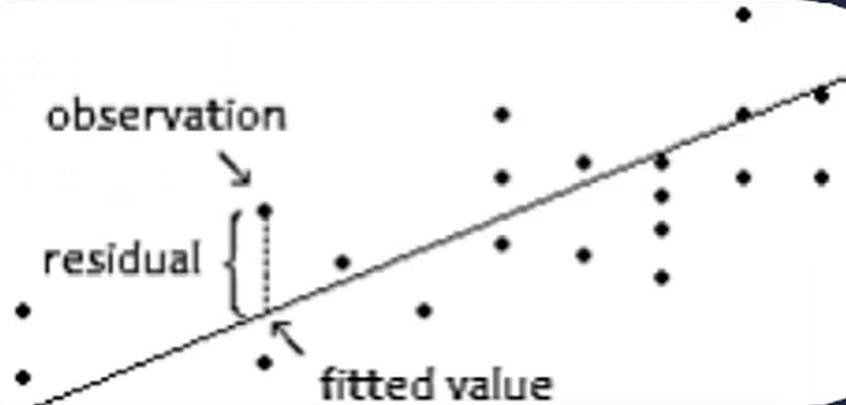

# Data Analyst Course Notes

## Types of Data Analysis

### 1. Descriptive Analysis
- **Definition**: Looks at past data and tells what happened.
- **Examples**: Tracking Key Performance Indicators (KPIs), revenue, sales leads, churn, etc.

### 2. Diagnostic Analysis
- **Definition**: Determines why something happened.
- **Examples**: Analyzing increased leads in October to identify contributing marketing efforts.

### 3. Predictive Analysis
- **Definition**: Predicts what is likely to happen in the future based on trends from past data.
- **Examples**: Risk assessment, sales forecasting, qualifying leads.

### 4. Prescriptive Analysis
- **Definition**: Combines insights from the previous three types to form a plan of action.
- **Examples**: Data-driven decision-making for organizational strategies.

---

## Statistical Data Types

### 1. Categorical (Qualitative) Data
- **Definition**: Represents distinct groups or labels.
- **Examples**:
  - **Nominal**: Gender (Male, Female), Colors (Red, Blue, Green).
  - **Ordinal**: Ratings (Low, Medium, High).

### 2. Numerical (Quantitative) Data
- **Definition**: Represents measurable quantities.
- **Examples**:
  - **Discrete**: Number of students in a class (0, 1, 2, ...).
  - **Continuous**: Height, Weight, Temperature.
  - **Interval** (No True Zero): Temperature in Celsius (0°C ≠ No Temperature).
  - **Ratio** (True Zero): Weight, Height, Income (0 means "none").

> **Note**: Binary data (e.g., Yes/No) often falls under nominal or interval/ratio categories.

---

## Descriptive Statistics

### 1. Central Tendency Parameters
These measures identify the center of a dataset:
- **Mean**: Average of all values.
- **Median**: Middle value when data is sorted.
- **Mode**: Most frequently occurring value.

### 2. Spread/Dispersion
These measures show variability in data:
- **Range**: Difference between the largest and smallest values.
- **Variance**: Measures how far values are from the mean. A higher variance indicates more spread in the data.
- **Standard Deviation (SD)**: Square root of variance; ; tells how much data deviates from the mean on average.
- **Interquartile Range (IQR)**: Difference between the 75th and 25th percentiles; measures the middle 50% of data. Helps in identifying outliers.
- **Standard Error of the Mean (SEM)**: Deviation of the sample mean from the population mean. Estimates how much the sample mean deviates from the true population mean.

---

## Visualizations

### 1. Categorical Data
- **Pie Chart**
- **Bar Chart**

### 2. Continuous Data
- **Boxplot**
- **Histogram**: Frequency distribution.

---

## Data Analysis ToolPack
- **Definition**: Excel add-in for financial, statistical, and engineering analysis.
- **Features**:
  - Descriptive Analysis
  - Histogram Creation

---

## Probabilities

- **Definition**: Helps make statements about confidence in estimates.
- **Key Terms**:
  - **Experiment**: A situation with uncertain outcomes.
  - **Outcome**: Result of a single trial.
  - **Event**: A specific result or set of results.
  - **Probability**: Ranges from 0 to 1.
  - **Sample Space**: All possible outcomes of an experiment.
  - **P(Success)** vs. **P(Failure)**: `P(Failure) = 1 - P(Success)`.

---

## Distributions

### 1. General Definition
- **Definition**: Describes all possible values for a variable and their frequencies.
- **Types**:
  - **Discrete**
  - **Continuous**

### 2. Bernoulli Distribution
- **Definition**: Two possible outcomes (e.g., success or failure).

### 3. Normal Distribution
- **Definition**: Fully described by mean and standard deviation.
- **Key Concept**: Central Limit Theorem.

---

## Characterization of Data
- **Location**: Central tendency (mean, median, mode).
- **Variability**: Spread of data (variance, SD, IQR).
- **Skewness**: Asymmetry of the data distribution.
- **Kurtosis**: Measure of the "tailedness" of the distribution.

Population vs. Sample:
- **Population**: Entire group of individuals or items.
- **Sample**: Subset of the population, selected to be representative of the larger population

### Sampling Methods
- **Simple Random Sampling**: Each member has an equal chance of being selected.
- **Systematic Sampling**: Selecting every nth member from a list.
- **Stratified Sampling**: Dividing the population into subgroups and sampling from each subgroup.
- **Cluster Sampling**: Dividing the population into clusters and randomly selecting entire clusters.

### Confidence Intervals (A.K.A Margin of Error)
- **Definition**: A range of values that is likely to contain the population parameter with a certain level of confidence (e.g., 95% confidence interval).

- **Formula**: CI = Sample Mean ± (Critical Value * Standard Error)
  - **Critical Value**: Based on the desired confidence level (e.g., z-score for normal distribution).
  - **Standard Error**: SD of the sample mean.
- **Interpretation**: If we were to take many samples and construct confidence intervals, we would expect 95% of them to contain the true population parameter.

### Inferencial Statistics
- **Definition**: Making inferences about a population based on a sample.
- **Key Concepts**:
  - **Hypothesis Testing**: Testing a claim about a population parameter.
    - **Null Hypothesis (H0)**: No effect or no difference.
    - **Alternative Hypothesis (H1)**: There is an effect or a difference.
  - **Critical Value**: The threshold that determines whether to reject the null hypothesis.
  - **Rejection Region**: The area in the tails of the distribution where we would reject H0.
  - **P-value**: Probability of observing the data given that the null hypothesis is true. A low p-value indicates strong evidence against H0.
  - **Type I Error**: Rejecting H0 when it is true (false positive).
  - **Type II Error**: Failing to reject H0 when it is false (false negative).

Steps on Inferencial Statistics
1. Define the null and alternative hypotheses.
2. Choose the significance level (alpha). a = 1 - confidence level (e.g., 0.05 for 95% confidence).
3. Define the critical value and rejection region. 
4. Calculate the test statistic.
5. Calculate the p-value.

### Regions for Normal Distributions
- Acceptance Region: The area under the curve where we fail to reject the null hypothesis.
- Rejection Region: The area under the curve where we reject the null hypothesis.
- Critical Values for 90%, 95%, and 99% confidence levels correspond to z-scores of approximately 1.645, 1.96, and 2.576, respectively.
- The area under the curve for a normal distribution is always equal to 1.
- The total area under the curve is divided into two regions: the acceptance region and the rejection region.
- The rejection region is further divided into two tails: the left tail and the right tail.
- The left tail corresponds to the lower critical value, while the right tail corresponds to the upper critical value.
- The area in the left tail represents the probability of a Type I error (rejecting H0 when it is true), while the area in the right tail represents the probability of a Type II error (failing to reject H0 when it is false).
- The acceptance region is the area where we fail to reject the null hypothesis, and it is located between the two critical values.
- The area in the acceptance region represents the probability of correctly failing to reject H0 when it is true.

### Test Statistic
- **Definition**: A standardized value that is calculated from sample data during a hypothesis test.
- **Formula**: 
  - For a z-test: 
    \[
    z = \frac{\bar{x} - \mu}{\frac{\sigma}{\sqrt{n}}}
    \]
  - For a t-test:
    \[
    t = \frac{\bar{x} - \mu}{\frac{s}{\sqrt{n}}}
    \]
  where:
  - \(\bar{x}\) = sample mean
  - \(\mu\) = population mean
  - \(s\) = sample standard deviation
  - \(n\) = sample size

#### Conclusions
1. Reject null hypothesis if the test statistic falls in the rejection region (beyond critical values) and accept alternative hypothesis, or 

2. do not reject null hypothesis if the test statistic falls in the acceptance region (within critical values).

## Critical Values for Normal Distribution

| Alpha (\(\alpha\)) | Upper/Right Tailed Test (\(Z >\)) | Lower/Left Tailed Test (\(Z <\)) | Two-Tailed Test (\(Z <\) or \(Z >\)) |
|---------------------|-----------------------------------|----------------------------------|--------------------------------------|
| 0.10               | 1.28                             | -1.28                           | ±1.645                              |
| 0.05               | 1.645                            | -1.645                          | ±1.96                               |
| 0.01               | 2.33                             | -2.33                           | ±2.576                              |

> **Note**: For two-tailed tests, the alpha value is split equally between the two tails (e.g., \(\alpha = 0.05\) means 0.025 in each tail).

### Estimation
- **Point Estimation**: A single value estimate of a population parameter (e.g., sample mean as an estimate of population mean).

- **Interval Estimation**: A range of values (confidence interval) that likely contains the population parameter.
  - **Confidence Interval**: A range of values derived from a sample that is likely to contain the population parameter with a specified level of confidence (e.g., 95% confidence interval).

- **Least Minimum Squares (LMS)**: A method used in regression analysis to estimate the parameters of a linear model by minimizing the sum of the squares of the differences between observed and predicted values.

